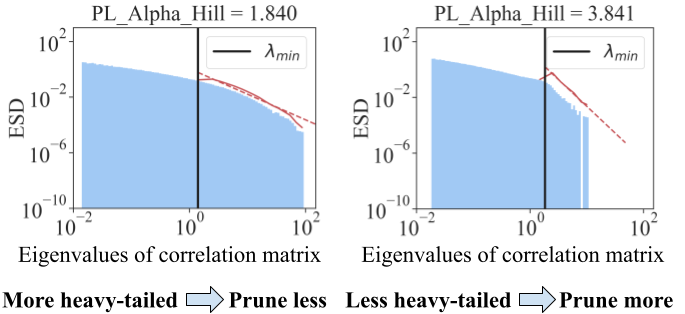

#  AlphaPruning: Using Heavy-Tailed Self Regularization Theory for Improved Layer-wise Pruning Large Language Models

Official PyTorch implementation of **AlphaPruning**

## Introduction
Alpha-Pruning is a layer-wise pruning method for LLMs based on HT-SR Theory. The basic idea is to analyze the ESDs of trained weight matrices, and to use shape metrics from these ESDs to estimate the sparsity allocated for each layer.

<p align="center">

</p>

Blue histograms depict the ESDs. Solid red curves represent the tail part of the ESDs truncated by λ<sub>min</sub>, while dashed red curves represent the fitted HT distributions. The PL Alpha Hill metric measures the PL exponent of the ESD.

---
## Setup
Installation instructions can be found in [INSTALL.md](INSTALL.md).

## Minimal Example
```
bash script/llama_prune.sh
```
This script would compress the LLaMA-7B model with 70\% parameters pruned using our wanda_ww method. All the pre-trained models and the dataset would be automatically downloaded, so you do not need to manually download the resource. When running this script for the first time, it will require some time to download the model and the dataset.

--- 
### Script example of pruning LLaMA-V1-7b using Magnitude-based pruning with our layer-wise pruning ratio
```
python   main.py    \
--model pinkmanlove/llama-7b-hf    \
--cache_dir llm_weights/
--prune_method magnitude_ww     \
--sparsity_ratio 0.7 \
--save save_test/ \
--epsilon 0.3 \
```

### Script example of pruning LLaMA-V1-7b using Wanda with our layer-wise pruning ratio
```
python   main.py    \
--model pinkmanlove/llama-7b-hf     \
--cache_dir llm_weights/
--prune_method wanda_ww     \
--sparsity_ratio 0.7 \
--save save_test/ \
--epsilon 0.2 \
```

### Script example of pruning LLaMA-V1-7b using SparseGPT with our layer-wise pruning ratio
```
python   main.py    \
--model pinkmanlove/llama-7b-hf  \
--cache_dir llm_weights/
--prune_method sparsegpt_ww     \
--sparsity_ratio 0.7 \
--save save_test/ \
--epsilon 0.2 \
```
###  To prune more LLMs, you can change the "model" arguments in the script.

## Usage
We provide a quick overview of the arguments:  
- `--model`: The identifier for the LLaMA model on the Hugging Face model hub.
- `--cache_dir`: Directory for loading or storing LLM weights. The default is `llm_weights`.
- `--prune_method`: We have implemented these pruning methods, namely [`magnitude`, `wanda`, `sparsegpt`, `magnitude_ww`, `wanda_ww`, `sparsegpt_ww`].
- `--sparsity_ratio`: Denotes the percentage of weights to be pruned.
- `--save`: Specifies the directory where the result will be stored.
- `--WW_metric`: The ESDs metric used to diagnose layer quality and assign layer-wise pruning ratios. The default is `alpha_peak`.
- `--WW_metric_cache`: Directory for saving the layer-wise metric value of the model before pruning.
- `--epsilon`: Denotes the hyperparameter to control the range of pruning ratios. The default is `0.2`.


**More details coming soon!**
